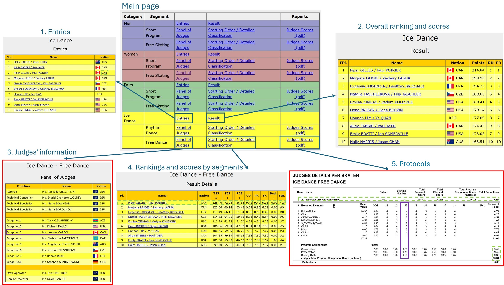

# Web Scraping of ISU Figure Skating Competition Results
## Project Summary
This project scrapes International Skating Union (ISU) figure skating competition results from the 2004–2005 season to the 2024–2025 season. For each competition, The scraped dataset includes overall rankings and scores, as well as detailed protocols (scoring sheets that document the score given by each judge for each element) and judges' information. These datasets are used for downstream analysis, such as investigating block judging in figure skating competitions.

## Quick Start
```
# 1. Create environment and install dependencies
python -m venv .env
source .env/bin/activate # (macOS/Linux)
pip install -r requirements.txt

# 2. Run the pipeline
cd scripts
bash run_pipeline.sh
```

## Background
Figure skating is a sport in which skaters execute pre-planned technical elements (e.g., jumps, spins) within a choreographed routine set to music. There are typically two segments in each competition: short program/rhythm dance (SP) and long program/free dance (LP).[^1] Most competitions contain four disciplines: women, men, ice dance, and pairs. Under the ISU Judging System (IJS), a panel of (typically) 9 judges gives two scores in each segment: the technical element score (TES) and the program component score (PCS). The TES reflects the difficulty and quality of execution for technical elements (such as jumps and spins), and the PCS evaluates the artistic and presentation aspects of the program.

In each season, the ISU holds approximately 18 Level-A competitions, the highest level of international competitions in the sport. These typically include seven Junior Grand Prix (JGP) Series events, six Grand Prix (GP) Series events, the Grand Prix Final (GPF), the Four Continents Championships, the European Championships, the World Championships, and the Junior World Championships. In Olympic seasons, the Olympic Games are also included.

## Data
ISU publicizes the detailed competition results after each competition, including not only final rankings and scores, but also the detailed protocols that document the scores given by each judge for each element. Figure 1 shows the information publicized by ISU for Grand Prix (GP) Canada 2024 (click [here](https://www.isuresults.com/results/season2425/gpcan2024/) to see the original webpage). We can see that for each discipline, ISU discloses
  1. Entries (atheletes participated in the competition); 
  2. Overal ranking and scores; 
  3. **Judges' information**; 
  4. Ranking and scores by segments
  5. **Protocols**.

Among these five components, judges’ information and protocols are the most informative. They not only contain detailed, element-by-element scores assigned by each judge, but also allow us to derive higher-level information found in the other components, such as skaters’ nationalities (also documented in 1), segment rankings and segment scores (also documented 3). Because judges’ information and protocols already subsume the content of the remaining components, I focus on these two sources for data collection.

For each competition, all available information is downloaded in HTML or PDF formats. Web scraping and PDF extraction techniques are then applied to reconstruct the judges’ information and protocols into structured tabular datasets.

<p align="center">
  
  <br>
  <em>Figure 1: Competition Results Available for GP Canada 2024</em>
</p>

## Pipeline Overview
run_pipeline.sh executes the following scripts in a sequential order.
1. 01_download_main_page_to_html.py
    - For each competition URL listed in ``data/links/comp_links.csv``, this script downloads the main results page as an HTML file and stores it under ``data/raw/{comp_name_abbre}/{comp_name_abbre}.html``.
        - ``data/links/comp_links.csv`` contains 379 competition URLs covering the 2004–2005 through 2024–2025 seasons. These URLs are collected using the ISU’s link naming conventions combined with manual search and verification. <span style="color:blue">The version of comp_links.csv included in this repository contains a sample of 8 links for demonstration purposes</span>; the full list is available upon request.
2. 02_link_name_mapping.py
    - For each downloaded main results page, this script extracts the table containing internal links to the detailed competition information — namely, the five components described in the Data section — and constructs a mapping between each link and its corresponding descriptive name. The name mapping files are stored under ``data/raw/{comp_name_abbre}/link_name_mapping.json``.
3. 03_download_results_to_html_or_pdf.py
    - Using the ``link_name_mapping.json`` constructed in the previous step, this script downloads detailed competition results, protocols and judges' information (the five components described in the Data section) as HTML or PDF files and stores them under the respective competition directories.
4. 04_judge_scraping.py
    - This script identifies HTML files that contain judge information based on the ``link_name_mapping.json`` files created in step 02, and extracts judge information for each competition and saves it as pickled DataFrames in the respective competition directories.
5. 05_judge_cleaning.py
    - This script appends and cleans the judge information from all competitions and store it under ``data/cleaned/judges.pkl``. To preserve the origin of each record, the script adds contextual identifiers — including competition name, season, discipline (e.g., women), and segment (e.g., short program) — so that every row can be traced back to its source competition, discipline, and segment.
6. 06_protocol_pdf_scraping.py
    - This script identifies PDF files that contain the protocols (detailed scoring sheets) based on the ``link_name_mapping.json`` files created in step 02, and extracts detailed element-level scores assigned by each judge for each competition and saves it as pickled DataFrames in the respective competition directories.
7. 07_protocol_pdf_cleaning.py
    - This script appends and cleans the detailed element-level scores assigned by each judge from all competitions and store it under ``data/cleaned/protocols.pkl``. To preserve the origin of each record, the script adds contextual identifiers — including competition name, season, discipline (e.g., women), and segment (e.g., short program) — so that every row can be traced back to its source competition, discipline, and segment.

Each script generates and saves a log file in the ``logs/`` directory for debugging and sanity checking. The log files from running the full pipeline on all competitions are available upon request. 

To facilitate exploration and understanding of the data structure, a sample raw data folder, which contains outputs for steps 01-04 and 06, is included at ``data/raw/wc2014`` (see the original competition webpage [here](http://results.isu.org/results/wc2014/)). The cleaned datasets produced from running the pipeline on the sample ``data/links/comp_links.csv`` file are also included in ``data/cleaned``.

## Project Structure
```
|-- README.md
|-- data
|   |-- cleaned
|   |   |-- judges.pkl # cleaned dataset for judge information (output of step 05)
|   |   `-- protocols.pkl # cleaned dataset for protocols (output of step 07)
|   |-- links
|   |   `-- comp_links.csv # input dataset (a sample list of competition result page URLs; full list available upon request)
|   `-- raw
|       `-- wc2014 # a sample raw data folder, which contains outputs for steps 01-04 and 06
|-- logs # execution logs (available upon request)
|-- requirements.txt
|-- screenshots
|   `-- gpcan.jpg # README figure 1
`-- scripts # pipeline scripts
```


[^1]: Before the 2011-2013 season, the ice dance had three segments: compulsory dance (CD), original dance (OD) and free dance (FD).